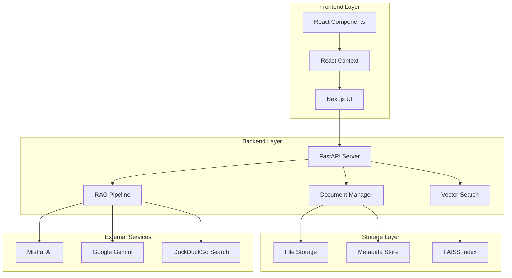
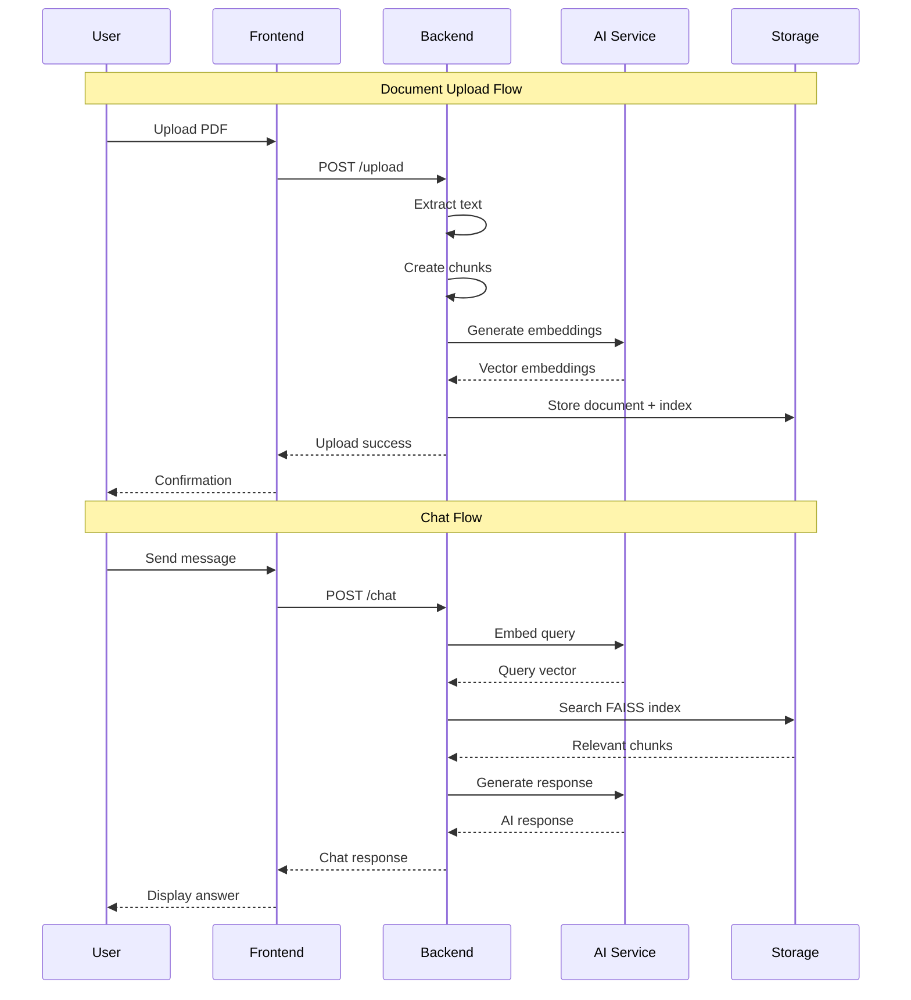
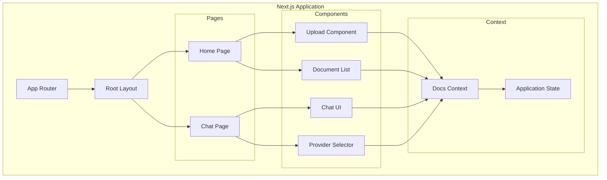
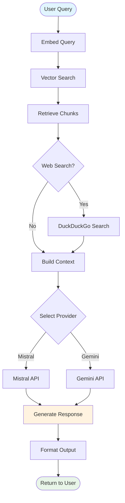
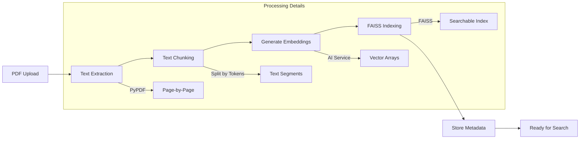
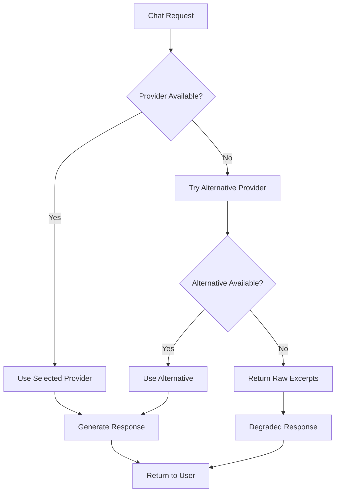
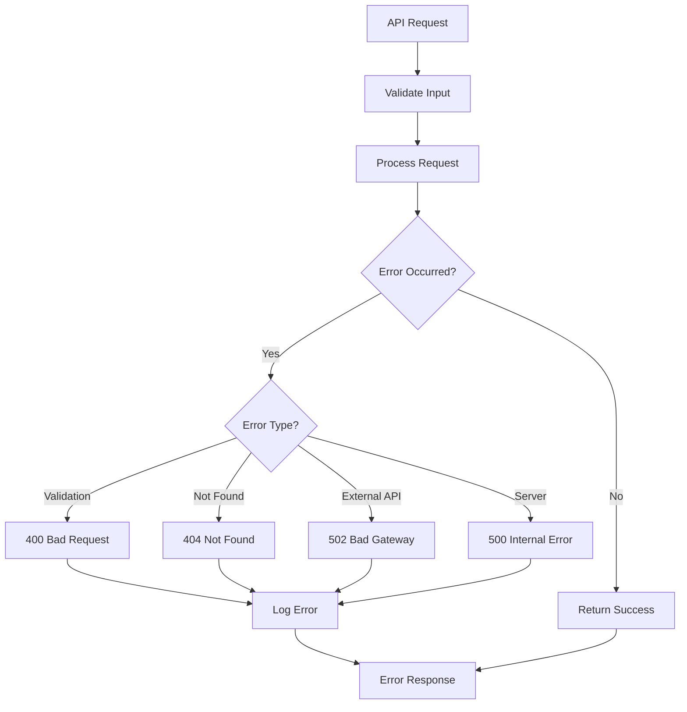
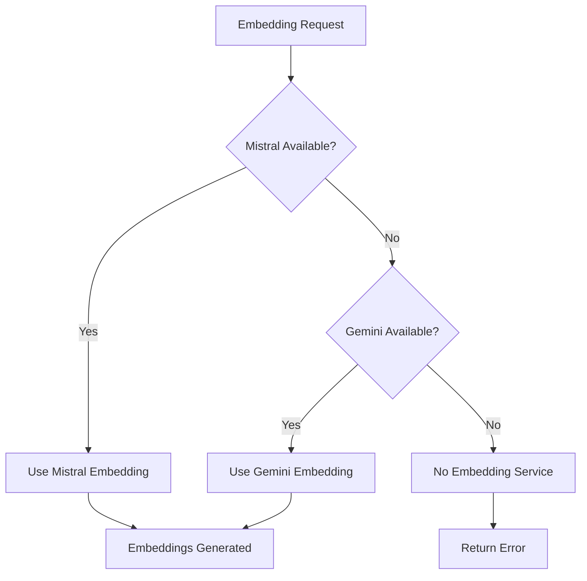

# RAGDoc Architecture Documentation

## 🏗️ System Overview

RAGDoc is a full-stack Retrieval-Augmented Generation (RAG) application that enables intelligent conversations with PDF documents using state-of-the-art AI models.

## 📊 High-Level Architecture



## 🔄 Data Flow Architecture



## 🏛️ Component Architecture

### Frontend Architecture



### Backend Architecture

```mermaid
graph TD
    subgraph "FastAPI Application"
        APP[FastAPI App]
        CORS[CORS Middleware]
        STATIC[Static Files]
        
        subgraph "API Endpoints"
            HEALTH[/health]
            DOCS[/documents]
            UPLOAD[/upload]
            CHAT[/chat]
            FILES[/files]
        end
        
        subgraph "Core Services"
            DOCMGR[Document Manager]
            EMBED[Embedding Service]
            SEARCH[Search Service]
            RAGPIPE[RAG Pipeline]
        end
        
        subgraph "AI Integrations"
            MISTRALAI[Mistral Client]
            GEMINIAI[Gemini Client]
            WEBSEARCH[Web Search]
        end
        
        subgraph "Storage"
            FILESYSTEM[File System]
            FAISSDB[FAISS Database]
            METADATA[JSON Metadata]
        end
    end
    
    APP --> CORS
    APP --> STATIC
    APP --> HEALTH
    APP --> DOCS
    APP --> UPLOAD
    APP --> CHAT
    APP --> FILES
    
    UPLOAD --> DOCMGR
    CHAT --> RAGPIPE
    DOCS --> DOCMGR
    
    DOCMGR --> EMBED
    RAGPIPE --> SEARCH
    RAGPIPE --> MISTRALAI
    RAGPIPE --> GEMINIAI
    RAGPIPE --> WEBSEARCH
    
    EMBED --> MISTRALAI
    EMBED --> GEMINIAI
    SEARCH --> FAISSDB
    DOCMGR --> FILESYSTEM
    DOCMGR --> METADATA
```

## 🛠️ Technical Stack Details

### Frontend Stack
- **Framework**: Next.js 14 with App Router
- **Language**: TypeScript for type safety
- **Styling**: Tailwind CSS for utility-first styling
- **State Management**: React Context API
- **HTTP Client**: Fetch API with async/await

### Backend Stack
- **Framework**: FastAPI for high-performance API
- **Language**: Python 3.10+ with type hints
- **PDF Processing**: PyPDF for text extraction
- **Vector Database**: FAISS for similarity search
- **Validation**: Pydantic for data models
- **Server**: Uvicorn ASGI server

### AI/ML Stack
- **Embedding Models**:
  - Mistral Embed (mistral-embed)
  - Google Text Embedding 004
- **Chat Models**:
  - Mistral Large Latest
  - Google Gemini 1.5 Flash
- **Vector Operations**: NumPy for numerical computing

## 📋 RAG Pipeline Workflow



## 🔧 Document Processing Pipeline



## 🗄️ Data Models

### Core Data Structures

```python
# Document Model
class Document(BaseModel):
    id: str                    # UUID
    name: str                  # Original filename
    uploadedOn: str           # ISO timestamp
    size: int                 # File size in bytes
    type: str = "pdf"         # Document type
    fileUrl: Optional[str]    # Serving URL

# Chat Request
class ChatRequest(BaseModel):
    docId: str                # Document UUID
    message: str              # User query
    max_chunks: int = 4       # Max retrieved chunks
    provider: str = "mistral" # AI provider

# Chat Response
class ChatResponse(BaseModel):
    answer: str               # AI generated answer
    reference: Optional[ChatReference] # Doc reference
    origin: str = "document"  # Source type
    sources: Optional[List[WebSource]] # Web sources
```

### Storage Structure

```
storage/
├── documents.json          # Document catalog
├── files/                  # Original PDF files
│   └── {doc_id}.pdf
├── indexes/                # FAISS vector indexes
│   └── {doc_id}.faiss
└── meta/                   # Document metadata
    └── {doc_id}.json
```

## 🔀 Provider Fallback Strategy



## 🛡️ Error Handling Strategy

### API Error Handling



### Embedding Service Fallback



## 🚀 Performance Optimizations

### Vector Search Optimization
- **Batch Processing**: Process multiple embeddings in batches
- **Token Limits**: Respect API token limits for efficiency
- **Caching**: Cache computed embeddings and indexes
- **Chunking Strategy**: Optimal text chunk sizes for retrieval

### Frontend Optimization
- **Code Splitting**: Lazy load components
- **State Management**: Efficient React Context usage
- **API Caching**: Cache document lists and metadata
- **Responsive Design**: Optimized for all device sizes

### Backend Optimization
- **Async Operations**: Non-blocking I/O operations
- **Connection Pooling**: Efficient HTTP client usage
- **Memory Management**: Proper cleanup of large objects
- **Static File Serving**: Direct file serving with FastAPI

## 🔒 Security Considerations

### API Security
- **CORS Configuration**: Proper cross-origin settings
- **Input Validation**: Pydantic model validation
- **File Upload Limits**: Size and type restrictions
- **Error Sanitization**: No sensitive data in error messages

### Data Security
- **API Key Management**: Environment variable storage
- **File Isolation**: Sandboxed file storage
- **Access Control**: No direct file system access
- **Data Validation**: Comprehensive input sanitization

## 📈 Scalability Considerations

### Horizontal Scaling
- **Stateless Design**: No server-side sessions
- **External Storage**: File system can be replaced with cloud storage
- **Load Balancing**: Multiple backend instances supported
- **Database Migration**: FAISS can be replaced with vector databases

### Vertical Scaling
- **Memory Optimization**: Efficient vector storage
- **CPU Utilization**: Optimized embedding computations
- **Disk I/O**: Efficient file operations
- **Network Optimization**: Minimized API calls

## 🔮 Future Architecture Enhancements

### Planned Improvements
1. **Microservices**: Split into specialized services
2. **Vector Database**: Migrate from FAISS to Pinecone/Weaviate
3. **Caching Layer**: Redis for improved performance
4. **Authentication**: User management and access control
5. **Monitoring**: Comprehensive logging and metrics
6. **CI/CD Pipeline**: Automated testing and deployment

### Technology Evolution
- **Streaming Responses**: Real-time response generation
- **Multi-modal Support**: Images and tables in documents
- **Advanced RAG**: Hybrid search and re-ranking
- **Cloud Native**: Kubernetes deployment support